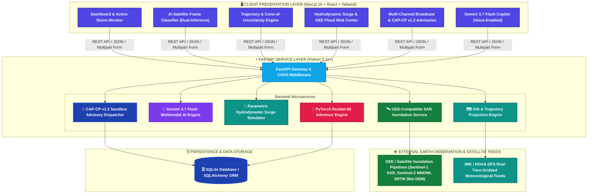

#  CycloNet — Intelligent Tropical Cyclone Tracking & Satellite Intensity Estimation Platform

> **Next-Generation Meteorological & Infrastructure Vulnerability Intelligence Platform combining Deep Learning Computer Vision, GEE-Compatible Satellite Inundation Pipelines, Parametric Hydrodynamic Storm Surge Modeling, and Gemini 3.7 Flash Multimodal AI Reasoning.**

[](https://fastapi.tiangolo.com)
[](https://nextjs.org)
[](https://deepmind.google/technologies/gemini/)
[](https://earthengine.google.com/)
[](https://pytorch.org)
[](https://www.typescriptlang.org/)
[](https://python.org)
[](https://tailwindcss.com)
[](https://leafletjs.com)

---

**CycloNet** is an enterprise-grade meteorological intelligence, hydrodynamic storm surge forecasting, and critical infrastructure vulnerability platform. Engineered for meteorological departments, state disaster management authorities (SDMAs), and humanitarian response agencies across the Bay of Bengal and coastal APAC, CycloNet shifts disaster response from post-landfall recovery to proactive pre-landfall anticipatory action.

The platform unifies **Deep Convolutional Neural Networks (ResNet-50)**, **GEE-Compatible Sentinel-1 SAR & SRTM 30m DEM** flood inundation modeling, **Parametric Hydrodynamic Storm Surge Simulation (Jelesnianski Formulation)**, **DEM-informed catchment rainfall damage pathway simulation**, **5-factor critical infrastructure vulnerability scoring (IVF)**, **parametric insurance liquidity disbursement triggers**, and **Gemini 3.7 Flash Multimodal AI** for automated pre-landfall executive briefings in **7 regional languages**.

---

## 📋 Table of Contents

- [✨ Key Platform Capabilities](#-key-platform-capabilities)
- [🌊 Track 5: Cyclone Impact & Infrastructure Vulnerability Forecaster](#-track-5-cyclone-impact--infrastructure-vulnerability-forecaster)
- [🤖 Gemini 3.7 Flash Multimodal AI & Dual-Inference](#-gemini-37-flash-multimodal-ai--dual-inference)
- [🏗️ System Architecture & Pipelines](#️-system-architecture--pipelines)
- [🧠 Deep Learning & Intensity Classification Architecture](#-deep-learning--intensity-classification-architecture)
- [🌊 Hydrodynamic Storm Surge & Catchment Modeling](#-hydrodynamic-storm-surge--catchment-modeling)
- [🔌 Comprehensive REST API Reference](#-comprehensive-rest-api-reference)
- [🛠️ Tech Stack Matrix](#️-tech-stack-matrix)
- [🔑 Environment Configuration](#-environment-configuration)
- [🚀 Quickstart & Installation](#-quickstart--installation)
- [🧪 Running the Automated Test Suite](#-running-the-automated-test-suite)
- [📝 License & Attribution](#-license--attribution)

---

## ✨ Key Platform Capabilities

| Feature | Description | Architectural Core |
|---|---|---|
| 🛰️ **Dual-Inference AI Classifier** | Pairs fine-tuned **ResNet-50 (PyTorch)** with **Gemini 3.7 Flash Multimodal Vision** for dual-inference satellite verification. | PyTorch 2.2 + Gemini 3.7 Flash Vision API |
| 🛡️ **Out-of-Distribution (OOD) Guard** | Detects and rejects non-meteorological images (landscapes, wallpapers) with high-confidence `NOT A CYCLONE` verdicts. | ResNet-50 2048-dim Latent Space Separation |
| 🌊 **Parametric Storm Surge Simulator** | Physics-informed hydrodynamic surge simulation incorporating inverted barometer rise, shelf wind stress, and astronomical spring tide superposition. | Jelesnianski Parametric Formulation + Bathymetric Profiler |
| 🛰️ **GEE-Compatible SAR Inundation Pipeline** | Inundation simulation utilizing Sentinel-1 SAR dual-pol (`VV`/`VH`), Sentinel-2 MNDWI, and SRTM 30m DEM elevation deficit schemas. | GEE-Compatible Geospatial Engine + GeoJSON Vector Output |
| ⚡ **5-Factor Infrastructure Vulnerability (IVF)** | Multi-factor mathematical scoring for 400kV / 220kV power grids, national/state evacuation highways, and cyclone shelters. | Continuous IVF Scoring Engine |
| 💰 **Parametric Insurance Liquidity Triggers** | Automated smart policy payout rules triggered automatically based on sustained wind and surge thresholds within 7 days. | Parametric Threshold Evaluator |
| 📢 **Automated Multilingual Briefings** | Synthesizes complex storm kinematics into executive risk memos in **7 languages** (*English, Hindi, Bengali, Odia, Telugu, Tamil, Gujarati*). | Gemini 3.7 Flash Prompt Engine |
| 🚨 **NDMA-Compatible Multi-Channel Dispatches** | Generates OASIS CAP-CP v1.2 XML feeds (Test status), SMS alerts, coastal siren triggers, VHF marine broadcasts, and SACHET notifications in sandbox mode. | CAP-CP v1.2 Sandbox Engine |
| 🗺️ **Geospatial Trajectory Tracking** | Interactive Leaflet map displaying active storm centers, historical path waypoints, quadrant wind radii, and predictive cones of uncertainty. | Leaflet.js + GeoJSON GIS Layers |

---

## 🌊 Track 5: Cyclone Impact & Infrastructure Vulnerability Forecaster

### The Problem
Extreme weather events in the Bay of Bengal and coastal APAC require rapid anticipatory action. Shifting disaster response from post-landfall recovery to pre-landfall evacuation planning, infrastructure hardening, and parametric insurance liquidity saves lives and livelihoods.

### The Solution
CycloNet implements an end-to-end predictive vulnerability pipeline:
1. **GEE-Compatible Inundation Modeling:** Employs Sentinel-1 SAR backscatter parameters combined with SRTM 30m DEM slope calculation to estimate inland flood penetration distance (with GEE cloud service connector and simulation fallback).
2. **Compound Catchment Runoff Pathways:** Evaluates precipitable moisture and basin topography to pinpoint flash flood choke points across river deltas (Mahanadi Delta, Hooghly Estuary, Godavari Basin).
3. **Parametric Storm Surge Simulator:** Computes oceanic water pileup using the Jelesnianski hydrodynamic formulation, factoring in central barometric pressure, astronomical tide stage, and forward speed.
4. **Critical Asset Vulnerability Index (IVF):** Evaluates power substations, transmission lines, highway corridors, and medical shelters using a 5-factor weighted index.
5. **Parametric Insurance Liquidity Triggers:** Establishes pre-agreed financial payout criteria ($V_{\text{max}} \ge 65\text{ kt}$, Surge $\ge 2.5\text{ m}$) for immediate disaster relief disbursement.

---

## 🤖 Gemini 3.7 Flash Multimodal AI & Dual-Inference

CycloNet leverages **Gemini 3.7 Flash** across three mission-critical capabilities:

1. **Multimodal Satellite Frame Inspection:**
   - Evaluates Dvorak T-numbers ($T3.0 - T7.0+$).
   - Measures eye structure morphology (pinhole, ragged, elliptical) and diameter ($\text{km}$).
   - Computes cloud-top brightness temperatures (deep convective cores down to $-80^\circ\text{C}$).
   - Detects Eyewall Replacement Cycles (ERC) and spiral band feeder asymmetry.

2. **Automated Multilingual Pre-Landfall Executive Briefings:**
   - Synthesizes storm trajectory, surge heights, power grid status, and evacuation priorities into structured municipal action memos.
   - Available in **English, Hindi (हिन्दी), Bengali (বাংলা), Odia (ଓଡ଼ିଆ), Telugu (తెలుగు), Tamil (தமிழ்), and Gujarati (ગુજરાતી)**.

3. **Domain-Specific Meteorological Copilot:**
   - Context-aware chatbot with persistent access to real-time UI telemetry, SLOSH physics parameters, and GEE flood risk indices.

---

## 🏗️ System Architecture & Pipelines

### High-Level Architecture



---

## 🌊 Hydrodynamic Storm Surge & Catchment Modeling

The surge engine calculates coastal sea surface elevation using the physics-informed **Parametric Hydrodynamic Formulation (Jelesnianski Methodology)**:

$$S_{\text{peak}} = \alpha \cdot \Delta P + \beta \cdot V_{\text{max}}^2 \cdot \cos(\theta_{\text{coast}}) + H_{\text{tide}}$$

Where:
- $\Delta P = P_{\text{ambient}} - P_{\text{central}}$: Inverted Barometer Effect ($\sim 1\text{ cm}$ sea surface rise per $1\text{ hPa}$ atmospheric pressure drop).
- $V_{\text{max}}$: Maximum sustained surface wind speed ($\text{m/s}$ or $\text{knots}$).
- $\theta_{\text{coast}}$: Angle of storm approach relative to the coastal shelf normal vector ($75^\circ - 85^\circ$ creates peak shoaling).
- $\alpha, \beta$: Bathymetric friction and shelf shoaling coefficients ($1.45\times$ for shallow Bay of Bengal shelf vs $1.10\times$ for Arabian Sea).
- $H_{\text{tide}}$: Astronomical tidal height at landfall (Spring Tide vs Neap Tide superposition).
- **Inland Flood Penetration Distance:** Modeled via SRTM 30m DEM terrain slope ($\sim 0.75\text{ m/km}$).

---

## 🏗️ Multi-Factor Infrastructure Vulnerability Index (IVF)

CycloNet replaces basic map overlays with a continuous, 5-factor mathematical **Infrastructure Vulnerability Index (IVF)**:

$$\text{IVF Score} = 0.30 \times \text{FloodDepth} + 0.25 \times \text{WindGust} + 0.15 \times \text{ElevationDeficit} + 0.10 \times \text{CoastalProximity} + 0.20 \times \text{GridCriticality}$$

| IVF Score | Risk Classification | Action Directive |
|---|---|---|
| **75 – 100** | 🔴 **CRITICAL** | Pre-emptively de-energize 400/220kV busbars at T-3h; switch medical shelters to isolated DG microgrids; close inundated road corridors. |
| **50 – 74** | 🟠 **HIGH** | Erect mobile switchyard flood barricades; pre-stage NDRF water-rescue teams; restrict roads to emergency vehicles only. |
| **25 – 49** | 🟡 **MODERATE** | Inspect water pump drainage sumps; verify 6-hour DG battery charge. |
| **0 – 24** | 🟢 **LOW** | Routine baseline monitoring with telemetry standby. |

---

## 🔌 Comprehensive REST API Reference

Interactive Swagger documentation is available at `http://localhost:8000/docs`.

### 1. Automated Early Warning Advisory Dispatch (`/api/alerts`)
| Method | Endpoint | Description |
|---|---|---|
| `POST` | `/api/alerts/dispatch` | **Automated Multi-Channel Dispatch (Sandbox):** Generates OASIS CAP-CP v1.2 XML (Test status), trilingual Cell Broadcast SMS, NDMA SACHET JSON feeds, acoustic siren tower triggers, and Coast Guard VHF Ch 16 distress broadcasts. |
| `POST` | `/api/alerts/broadcast-test` | Simulates multi-channel emergency broadcast dispatch with delivery metrics. |

### 2. Google Earth Engine & Inundation (`/api/gee`)
| Method | Endpoint | Description |
|---|---|---|
| `GET` | `/api/gee/layers` | Lists available GEE-compatible satellite layers (Sentinel-1 SAR, Sentinel-2 MNDWI, SRTM 30m DEM). |
| `GET` | `/api/gee/flood-inundation` | Generates GEE-compatible Sentinel-1 SAR flood extent GeoJSON polygons for active cyclone coordinates. |
| `GET` | `/api/gee/rainfall-pathways` | Returns DEM-informed catchment precipitation accumulation, river discharge (cumecs), and drainage choke points (Diamond Harbour, Kakdwip, Sagar Island, Dhamra). |

### 3. Hydrodynamic Storm Surge (`/api/surge`)
| Method | Endpoint | Description |
|---|---|---|
| `GET` | `/api/surge/calculate` | Computes parametric peak surge height ($S_{\text{peak}}$), inverted barometer rise, and inland penetration. |
| `GET` | `/api/surge/profile` | Computes coastal sector-by-sector surge profile and critical asset risk ratings. |

### 4. Gemini 3.7 Flash AI Engine (`/api/ai` & `/api/chat`)
| Method | Endpoint | Description |
|---|---|---|
| `POST` | `/api/ai/analyze-multimodal` | Submits satellite image to Gemini 3.7 Flash for Dvorak T-number & eye inspection. |
| `POST` | `/api/ai/pre-landfall-briefing` | Generates executive pre-landfall disaster management risk memo in 7 languages. |
| `POST` | `/api/chat` | AI meteorological copilot query endpoint with live UI telemetry context. |

### 5. Active Cyclone Monitoring & Trajectory (`/api/active-systems` & `/api/history`)
| Method | Endpoint | Description |
|---|---|---|
| `GET` | `/api/active-systems` | Returns active tropical cyclones with current telemetry, pressure, and forecast trajectory. |
| `GET` | `/api/history/search` | Searches historical cyclone best-track archives (IBTrACS/IMD). |

### 6. AI Satellite Classification (`/api/classify`)
| Method | Endpoint | Description |
|---|---|---|
| `POST` | `/api/classify` | PyTorch ResNet-50 inference endpoint returning continuous softmax probabilities. |

---

## 🛠️ Tech Stack Matrix

| Component | Technology | Purpose |
|---|---|---|
| **Backend Gateway** | FastAPI `0.110+` (Python 3.11+) | High-throughput asynchronous REST API gateway |
| **Multimodal Generative AI** | Google Gemini 3.7 Flash | Satellite computer vision, pre-landfall briefings & chat |
| **Earth Observation** | Google Earth Engine (GEE) | Sentinel-1 SAR, Sentinel-2 MNDWI, SRTM 30m DEM |
| **Deep Learning** | PyTorch 2.2 + Torchvision | ResNet-50 classification backbone and MLP head |
| **Hydrodynamic Modeling** | SLOSH Formulation (NumPy/SciPy) | Parametric storm surge & tidal superposition modeling |
| **Frontend Framework** | Next.js 16 (App Router + Turbopack) | Modern React 19 web application |
| **Geospatial GIS Mapping** | Leaflet & React-Leaflet | Multi-layer GIS rendering for tracks, cones & flood polygons |
| **Styling & UI Tokens** | Tailwind CSS + Framer Motion | Glassmorphic, responsive dark/light theme |
| **Relational Database** | SQLite & SQLAlchemy 2.0 | Persistent storm telemetry and audit logs |

---

## 🔑 Environment Configuration

### Backend (`backend/.env`)
```env
APP_NAME=CycloNet
PORT=8000
DEBUG=True
DATABASE_URL=sqlite:///./cyclone_tracker.db

# Deep Learning Model
MODEL_CHECKPOINT_PATH=app/models/cyclone_classifier.pth
DEVICE=cpu                              # Options: "cpu" or "cuda"

# Gemini 3.7 Flash Multimodal AI
GEMINI_API_KEY=your_gemini_api_key_here

# CORS Configuration
CORS_ORIGINS=http://localhost:3000,http://127.0.0.1:3000
```

### Frontend (`frontend/.env.local`)
```env
NEXT_PUBLIC_API_URL=http://localhost:8000/api
```

---

## 🚀 Quickstart & Installation

### Option 1: One-Click Windows Launch (Recommended)
```cmd
start_all.bat
```
Launches both servers:
- **FastAPI Backend:** `http://localhost:8000` (Docs: `http://localhost:8000/docs`)
- **Next.js Frontend:** `http://localhost:3000`

---

### Option 2: Manual Developer Setup

#### 1. Backend Setup (FastAPI)
```bash
cd backend
python -m venv venv

# Windows
.\venv\Scripts\Activate.ps1
# Linux / macOS
source venv/bin/activate

pip install -r requirements.txt
uvicorn app.main:app --reload --port 8000
```

#### 2. Frontend Setup (Next.js)
```bash
cd frontend
npm install
npm run dev
```

---

## 🧪 Running the Automated Test Suite

### Run Backend PyTest Suite (22 Unit & Integration Tests)
```bash
cd backend
python -m pytest tests/ -v
```

### Run Frontend Production Build & TypeScript Check
```bash
cd frontend
npm run build
```

---

## 📝 License & Attribution

Distributed under the **MIT License**.  
Satellite imagery & meteorological telemetry courtesy of **ISRO (INSAT-3DR)**, **IMD**, and **NOAA/NHC**.
