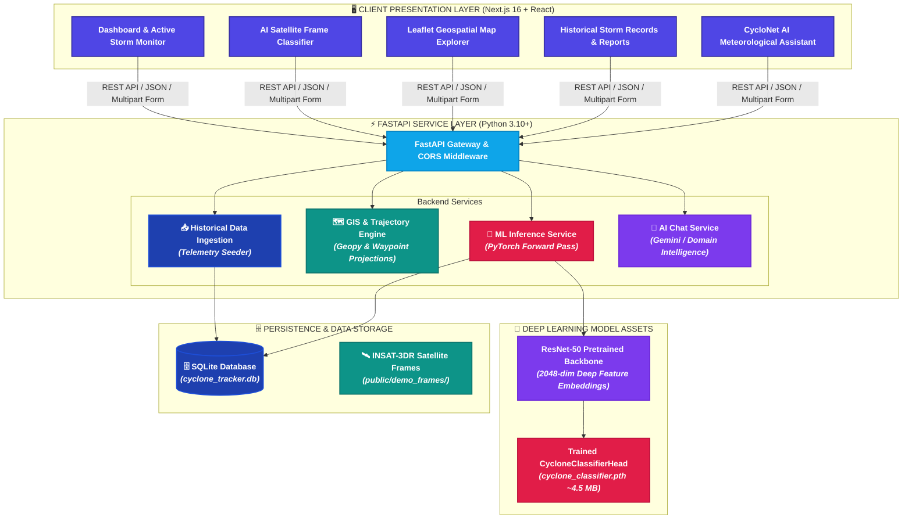
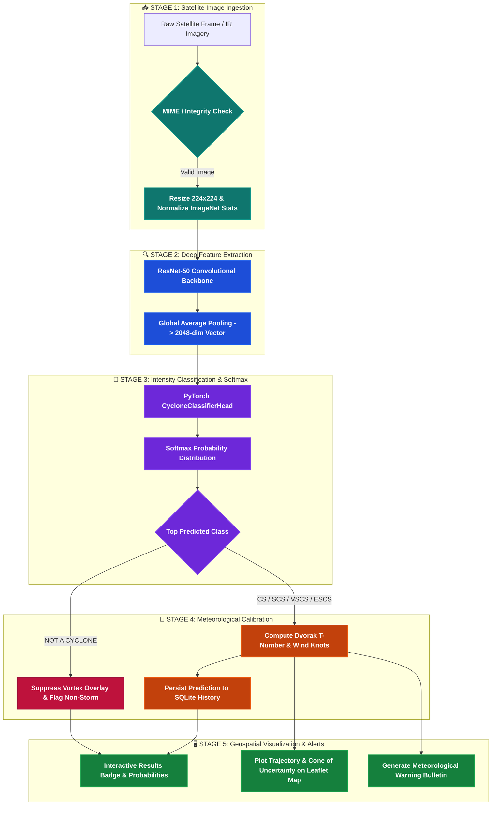

#  CycloNet — Intelligent Tropical Cyclone Tracking & Satellite Intensity Estimation Platform

> **Next-Generation Meteorological Intelligence Platform combining Deep Learning Computer Vision, Geospatial Trajectory Modeling, Dvorak Intensity Estimation, and Generative AI Meteorological Assistance.**

[](https://fastapi.tiangolo.com)
[](https://nextjs.org)
[](https://www.framer.com/motion/)
[](https://pytorch.org)
[](https://pytorch.org)
[](https://www.typescriptlang.org/)
[](https://python.org)
[](https://tailwindcss.com)
[](https://leafletjs.com)
[](https://sqlite.org)

---

**CycloNet** is an enterprise-grade meteorological analysis and disaster-response decision support platform. Designed for meteorological departments, disaster management authorities, and climate researchers, the platform unifies **Deep Convolutional Neural Networks (ResNet-50)**, **Dvorak intensity feature extraction**, **interactive geospatial tracking (Leaflet)**, **ensemble trajectory forecasting**, and **CycloNet AI — a context-aware Meteorological Intelligence Copilot with live voice recognition**.

Meteorologists can upload live infrared/visible satellite imagery (e.g., INSAT-3DR, GOES, Himawari) to receive instant intensity classifications, continuous softmax probability distributions, estimated sustained wind speeds (knots), Dvorak T-numbers, and track coordinates with predictive cone-of-uncertainty projections.

---

## 📋 Table of Contents

- [✨ Key Features](#-key-features)
- [🤖 CycloNet AI Assistant & Liquid Glass](#-cyclonet-ai-assistant--liquid-glass)
- [🏗️ System Architecture & Pipelines](#️-system-architecture--pipelines)
  - [High-Level Architecture](#high-level-architecture)
  - [5-Stage Meteorological Processing Pipeline](#5-stage-meteorological-processing-pipeline)
  - [Inference & Classification Data Flow](#inference--classification-data-flow)
- [📁 Project Structure](#-project-structure)
- [🧠 Deep Learning & Intensity Classification Architecture](#-deep-learning--intensity-classification-architecture)
  - [Model Topology & Feature Extraction](#model-topology--feature-extraction)
  - [IMD Classification & Dvorak Scale Mapping](#imd-classification--dvorak-scale-mapping)
  - [Rotational Invariance & Augmentation](#rotational-invariance--augmentation)
  - [Adversarial & Non-Meteorological Rejection](#adversarial--non-meteorological-rejection)
- [🔌 Comprehensive REST API Reference](#-comprehensive-rest-api-reference)
- [🛠️ Tech Stack Matrix](#️-tech-stack-matrix)
- [🔑 Environment Configuration](#-environment-configuration)
- [🚀 Quickstart & Installation](#-quickstart--installation)
  - [Option 1: One-Click Windows Launch](#option-1-one-click-windows-launch-recommended)
  - [Option 2: Manual Developer Setup](#option-2-manual-developer-setup)
- [🧪 Model Training & Fine-Tuning Pipeline](#-model-training--fine-tuning-pipeline)
- [📊 Historical Storm Archives & Bulletins](#-historical-storm-archives--bulletins)
- [🔐 Security & Production Hardening](#-security--production-hardening)
- [📝 License & Attribution](#-license--attribution)

---

## ✨ Key Features

| Feature | Description | Architectural Core |
|---|---|---|
| 🛰️ **Deep Learning Intensity Classifier** | Fine-tuned **ResNet-50 + Multi-Layer Perceptron Head** trained in PyTorch for genuine forward-pass inference. | PyTorch 2.2 + Torchvision Feature Backbone |
| 🛡️ **Out-of-Distribution (OOD) Guard** | Detects and rejects non-meteorological images (landscapes, wallpapers, anime) with high-confidence `NOT A CYCLONE` verdicts. | ResNet-50 2048-dim Latent Space Separation |
| 📐 **Dvorak T-Number & Wind Estimation** | Automatic mapping of structural vortex signatures to **Dvorak T-Numbers** ($T3.0 - T5.5+$) and sustained wind speeds ($45 - 105+$ kt). | Automated Dvorak Heuristic Engine |
| 🗺️ **Geospatial Trajectory Tracking** | Interactive map dashboard displaying active storm centers, historical path waypoints, wind radiuses, and predicted forecast cones. | Leaflet.js + GeoJSON GIS Layers |
| 🌀 **Global Cyclone Synchronization** | Selecting any cyclone from the Archive or Live Map automatically updates active storm telemetry across all tabs and components. | Custom React Hook (`useActiveCyclone`) + Broadcast Events |
| 🤖 **CycloNet AI Meteorological Copilot** | Draggable, resizable AI assistant with **Liquid Glass refraction**, **real-time voice input**, live UI telemetry context, and domain expertise. | Google Gemini / FastAPI AI Service + Web Speech API |
| 📜 **Historical Cyclone Archive** | Searchable database of past historical cyclones (Amphan, Tauktae, Biparjoy, Irma, Dorian) with complete meteorological telemetry. | SQLite + SQLAlchemy ORM |
| 📑 **Automated Warning Bulletins** | Generates real-time disaster advisories, danger-zone classifications, and exportable PDF case reports for emergency officials. | Next.js Dynamic Report Generator |
| 🌓 **Glassmorphic Modern UI** | Polished dark/light theme with Tailwind CSS, unified brand logo, animated gradient triggers, Lucide icons, and mobile responsiveness. | Next.js 16 App Router + next-themes + Framer Motion |

---

## 🤖 CycloNet AI Assistant & Liquid Glass

CycloNet includes an intelligent meteorological copilot designed for emergency responders and meteorologists:

- **Liquid Glass Background**: Built with dynamic chromatic aberration, frosted refraction shaders, and fluid motion via the `useLiquidGlass` canvas engine.
- **Voice-Enabled Querying**: Integrated with the browser **Web Speech API** for hands-free speech-to-text querying directly in the field.
- **Context-Aware Reasoning**: Continuously ingests active UI telemetry, active cyclone IDs, wind speeds, and route parameters to answer situational questions (*e.g., "What is the expected landfall for the currently selected cyclone?"*).
- **Interactive Knowledge Cards**: Quick-start prompts for **Tropical Cyclogenesis**, **Dvorak T-number estimation**, **IMD vs. Saffir-Simpson scale comparisons**, and **Disaster Safety protocols**.
- **Window Flexibility**: Freely draggable via header grip, corner-resizable, minimizable, and persists window coordinates across page reloads.

---

## 🏗️ System Architecture & Pipelines

### High-Level Architecture



### 5-Stage Meteorological Processing Pipeline



### Inference & Classification Data Flow

```mermaid
flowchart LR
    classDef inputStyle fill:#3B82F6,stroke:#1D4ED8,stroke-width:2px,color:#FFFFFF,font-weight:bold
    classDef mlStyle fill:#8B5CF6,stroke:#6D28D9,stroke-width:2px,color:#FFFFFF,font-weight:bold
    classDef dvorakStyle fill:#CA8A04,stroke:#A16207,stroke-width:2px,color:#FFFFFF,font-weight:bold
    classDef outStyle fill:#10B981,stroke:#059669,stroke-width:2px,color:#FFFFFF,font-weight:bold
    classDef rejectStyle fill:#E11D48,stroke:#BE123C,stroke-width:2px,color:#FFFFFF,font-weight:bold

    Img["Satellite Image Upload<br/>(INSAT-3DR / GOES / NOAA)"]:::inputStyle --> Tensor["Transform Pipeline<br/>(Resize, Tensor, Normalize)"]:::inputStyle
    Tensor --> ResNet["ResNet-50 Backbone<br/>(Latent Space 2048-D)"]:::mlStyle
    ResNet --> Head["CycloneClassifierHead<br/>(FC 512 → BN → FC 128 → FC 5)"]:::mlStyle

    Head --> Softmax["Softmax Probabilities<br/>(Continuous Confidence %)"]:::mlStyle

    Softmax -->|Category Score| Dvorak["Dvorak Estimator<br/>(T3.0 to T5.5+ & Knots)"]:::dvorakStyle
    Softmax --> OutOfDist{"Is Cyclone?"}:::dvorakStyle

    OutOfDist -->|Yes| ValidOut["IMD Category + Wind Speed + Advisory"]:::outStyle
    OutOfDist -->|No| RejectOut["No Cyclone Detected (Non-Meteorological)"]:::rejectStyle

    ValidOut & RejectOut --> UI["Next.js Web Dashboard & History Log"]:::outStyle
```



---

## 📁 Project Structure

```text
CycloneTracker/
├── backend/                            # FastAPI Python core backend application
│   ├── app/
│   │   ├── main.py                     # FastAPI application factory, CORS, and route bindings
│   │   ├── api/
│   │   │   └── routes.py               # REST API endpoints (/api/cyclones, /api/classify, /api/chat, etc.)
│   │   ├── core/
│   │   │   └── database.py             # SQLite engine, SessionLocal, and declarative Base
│   │   ├── models/
│   │   │   ├── cyclone_classifier.pth  # Pretrained PyTorch classifier weights (~4.5 MB)
│   │   │   └── domain.py               # SQLAlchemy ORM models (Cyclone, Coordinates, Logs)
│   │   └── services/
│   │       ├── ml_service.py           # PyTorch inference engine & continuous softmax calculation
│   │       ├── chat_service.py         # AI Meteorological Assistant integration (Gemini / RAG)
│   │       ├── best_tracks.py          # Best-track interpolation and IBTrACS telemetry loader
│   │       └── data_ingestion.py       # Historical cyclone database seeder
│   ├── notebooks/
│   │   └── Model_Finetuning.ipynb      # Exploration and transfer learning research notebook
│   ├── train_classifier.py             # PyTorch training pipeline with 360° rotational augmentation
│   ├── test_api.py                     # Automated API inference test suite
│   └── requirements.txt                # Backend Python dependencies
│
├── frontend/                           # Next.js 16 modern web application
│   ├── src/
│   │   ├── app/
│   │   │   ├── layout.tsx              # Root HTML layout with theme provider & navigation
│   │   │   ├── page.tsx                # Active Cyclone Tracking & Geospatial Dashboard
│   │   │   ├── globals.css             # Tailwind styling and glassmorphic UI tokens
│   │   │   ├── classification/
│   │   │   │   └── page.tsx            # AI Satellite Classifier with live image upload & demo selector
│   │   │   ├── forecast/
│   │   │   │   └── page.tsx            # Storm trajectory, multi-model ensemble & cone-of-uncertainty
│   │   │   ├── archive/
│   │   │   │   └── page.tsx            # Searchable historical storm database & synchronized selection
│   │   │   ├── reports/
│   │   │   │   └── page.tsx            # Meteorological bulletins, advisories & PDF export
│   │   │   └── settings/
│   │   │       └── page.tsx            # Theme settings (Dark/Light), alerts & data feeds
│   │   ├── components/
│   │   │   ├── CycloneLogo.tsx         # Unified vector Cyclone Spiral logo
│   │   │   ├── ChatbotWidget.tsx       # CycloNet AI Assistant with Liquid Glass & Voice Input
│   │   │   ├── Header.tsx              # Application header bar with animated trigger & active storm pill
│   │   │   ├── Sidebar.tsx             # Responsive sidebar navigation with brand identity
│   │   │   ├── MapComponent.tsx        # Leaflet dynamic map wrapper with IMD track styling
│   │   │   ├── MapWidget.tsx           # Dashboard mini-map widget
│   │   │   └── theme-provider.tsx      # Next-themes dark/light context provider
│   │   └── hooks/
│   │       ├── useActiveCyclone.ts     # Cross-tab synchronized active storm state management
│   │       └── useLiquidGlass.ts       # Canvas liquid glass refraction shader hook
│   ├── public/
│   │   ├── logo.svg                    # Scalable vector brand logo
│   │   ├── liquid-glass.js             # Liquid glass shader engine
│   │   └── demo_frames/                # High-res authentic INSAT-3DR satellite storm imagery
│   │       ├── demo_1.jpg              # Cyclonic Storm (CS)
│   │       ├── demo_2.jpg              # Severe Cyclonic Storm (SCS)
│   │       ├── demo_3.jpg              # Very Severe Cyclonic Storm (VSCS)
│   │       └── demo_4.jpg              # Extremely Severe Cyclonic Storm (ESCS)
│   ├── package.json                    # Frontend dependencies and npm scripts
│   └── tsconfig.json                   # TypeScript configuration
│
└── start_all.bat                       # One-click Windows startup script (FastAPI + Next.js)
```

---

## 🧠 Deep Learning & Intensity Classification Architecture

### Model Topology & Feature Extraction

The classification system is built on a hybrid architecture combining a deep **ResNet-50** convolutional feature extractor with a dedicated **PyTorch Multi-Layer Perceptron (MLP) Classifier Head**:

```text
Input Satellite Frame (224 x 224 x 3)
                │
                ▼
┌──────────────────────────────────────────────┐
│       ResNet-50 Convolutional Backbone       │
│  (7x7 Conv, Residual Blocks, MaxPool, etc.)  │
└──────────────────────┬───────────────────────┘
                       │
                       ▼
┌──────────────────────────────────────────────┐
│      Adaptive Global Average Pooling         │
│          Output: 2048-dimensional Vector     │
└──────────────────────┬───────────────────────┘
                       │
                       ▼
┌──────────────────────────────────────────────┐
│        CycloneClassifierHead (PyTorch)       │
│  ├── Linear(2048, 512)                       │
│  ├── BatchNorm1d(512)                        │
│  ├── ReLU()                                  │
│  ├── Dropout(p = 0.4)                        │
│  ├── Linear(512, 128)                        │
│  ├── BatchNorm1d(128)                        │
│  ├── ReLU()                                  │
│  ├── Dropout(p = 0.3)                        │
│  └── Linear(128, 5)                          │
└──────────────────────┬───────────────────────┘
                       │
                       ▼
         Softmax Probability Vector
   [ P(OOD), P(CS), P(SCS), P(VSCS), P(ESCS) ]
```

### IMD Classification & Dvorak Scale Mapping

The platform aligns predicted classes with the official **India Meteorological Department (IMD)** cyclone intensity scale and the **Dvorak Technique (CI / T-Numbers)**:

| Class Code | Meteorological Designation | Sustained Winds (kt) | Dvorak T-Number | Structural Morphology |
|---|---|---|---|---|
| `NOT_A_CYCLONE` | **No Cyclone Detected (Non-Meteorological)** | $0\text{ kt}$ | $\text{N/A}$ | Terrestrial photos, wallpapers, or cloudless images. |
| `CS` | **Cyclonic Storm** | $34 - 47\text{ kt}$ | $T3.0$ | Curved cloud banding, emerging central dense overcast (CDO). |
| `SCS` | **Severe Cyclonic Storm** | $48 - 63\text{ kt}$ | $T3.5$ | Well-defined CDO, tightening feeder bands, incipient core. |
| `VSCS` | **Very Severe Cyclonic Storm** | $64 - 89\text{ kt}$ | $T4.5$ | Closed central core, ragged or emerging eye structure. |
| `ESCS` | **Extremely Severe Cyclonic Storm** | $90 - 119\text{ kt}$ | $T5.5+$ | Distinct, circular pinhole eye surrounded by intense symmetric eyewall. |

---

## 🔌 Comprehensive REST API Reference

All backend REST API endpoints are served by FastAPI. Interactive Swagger documentation is accessible at `http://localhost:8000/docs`.

### 1. Active Cyclone Monitoring (`/api/cyclones`)

| Method | Endpoint | Response Type | Description |
|---|---|---|---|
| `GET` | `/api/cyclones` | `JSON Array` | Returns all active cyclones with current coordinates, category, pressure, and wind speed. |
| `GET` | `/api/cyclones/{id}` | `JSON Object` | Retrieves full tracking telemetry, historical waypoints, and projected forecast paths for a storm. |

### 2. AI Intensity Classification (`/api/classify`)

| Method | Endpoint | Request Payload | Description |
|---|---|---|---|
| `POST` | `/api/classify` | `multipart/form-data (file)` | Uploads a satellite image. Executes PyTorch forward pass and returns category, confidence %, wind speed, Dvorak T-number, and complete softmax probability distribution. |

### 3. AI Meteorological Copilot Chat (`/api/chat`)

| Method | Endpoint | Request Payload | Description |
|---|---|---|---|
| `POST` | `/api/chat` | `JSON Object { message, history, ui_context }` | Submits meteorological user queries alongside real-time UI screen telemetry, active cyclone state, and past message history to generate grounded AI responses. |

### 4. Classification History & Audit Logs (`/api/history`)

| Method | Endpoint | Response Type | Description |
|---|---|---|---|
| `GET` | `/api/history/classifications` | `JSON Array` | Fetches persistent logs of all analyzed satellite images with timestamps and confidence scores. |

---

## 🛠️ Tech Stack Matrix

| Component | Technology | Version | Purpose |
|---|---|---|---|
| **Backend Framework** | FastAPI | `0.110.0` | High-throughput asynchronous REST API gateway |
| **Backend Runtime** | Python | `3.10+` | Server execution and deep learning runtime |
| **Deep Learning Framework** | PyTorch | `2.2.1` | Neural network forward pass, autograd, and training |
| **Computer Vision** | Torchvision & Pillow | `0.17.1` | Pretrained ResNet-50 backbone, image transforms |
| **Relational Database** | SQLite & SQLAlchemy | `2.0.28` | Persistent storage for storm telemetry and classification logs |
| **AI / NLP Services** | Google Gemini / OpenAI | API-Ready | Meteorological natural language reasoning & contextual assistance |
| **Frontend Framework** | Next.js | `16.0+` (App Router) | React application framework with Server Components |
| **Frontend Language** | TypeScript | `5.0+` | Static typing across UI components and API contracts |
| **Styling & Design** | Tailwind CSS | Latest | Utility-first CSS styling and glassmorphic themes |
| **Geospatial Mapping** | Leaflet & React-Leaflet | Latest | Interactive mapping for storm coordinates and trajectory cones |
| **Speech Recognition** | Web Speech API | Native Browser | Real-time voice speech-to-text input in the chatbot |
| **Animations & Motion** | Framer Motion | Latest | Fluid micro-interactions, drag/resize mechanics, and glassmorphic UI motion |

---

## 🔑 Environment Configuration

### Backend Configuration (`backend/.env`)

```env
# ── Application Settings ──────────────────────────────────────
APP_NAME=CycloNet
PORT=8000
DEBUG=True

# ── Database ──────────────────────────────────────────────────
DATABASE_URL=sqlite:///./cyclone_tracker.db

# ── Deep Learning Model ───────────────────────────────────────
MODEL_CHECKPOINT_PATH=app/models/cyclone_classifier.pth
DEVICE=cpu                              # Options: "cpu" or "cuda"

# ── AI Chat Assistant (Optional) ──────────────────────────────
GEMINI_API_KEY=your_gemini_api_key_here

# ── CORS Configuration ────────────────────────────────────────
CORS_ORIGINS=http://localhost:3000,http://127.0.0.1:3000
```

### Frontend Configuration (`frontend/.env.local`)

```env
NEXT_PUBLIC_API_URL=http://localhost:8000/api
```

---

## 🚀 Quickstart & Installation

### Option 1: One-Click Windows Launch (Recommended)

Double-click `start_all.bat` or run in terminal:
```cmd
start_all.bat
```
This script launches both servers in dedicated windows:
- **FastAPI Backend**: `http://localhost:8000`
- **Next.js Frontend**: `http://localhost:3000`

---

### Option 2: Manual Developer Setup

#### 1. Backend Setup (FastAPI)
```bash
cd backend

# Create and activate virtual environment
python -m venv venv

# Windows (PowerShell)
.\venv\Scripts\Activate.ps1
# Linux / macOS
source venv/bin/activate

# Install dependencies
pip install -r requirements.txt

# Start backend server
uvicorn app.main:app --reload --port 8000
```
Interactive API docs: `http://localhost:8000/docs`

#### 2. Frontend Setup (Next.js)
```bash
cd frontend

# Install Node dependencies
npm install

# Start Next.js development server
npm run dev
```
Open your browser at: `http://localhost:3000`

---

## 📝 License & Attribution

Distributed under the [MIT License](LICENSE).  
Satellite imagery courtesy of **ISRO (INSAT-3DR)** and **NOAA/NHC**.
