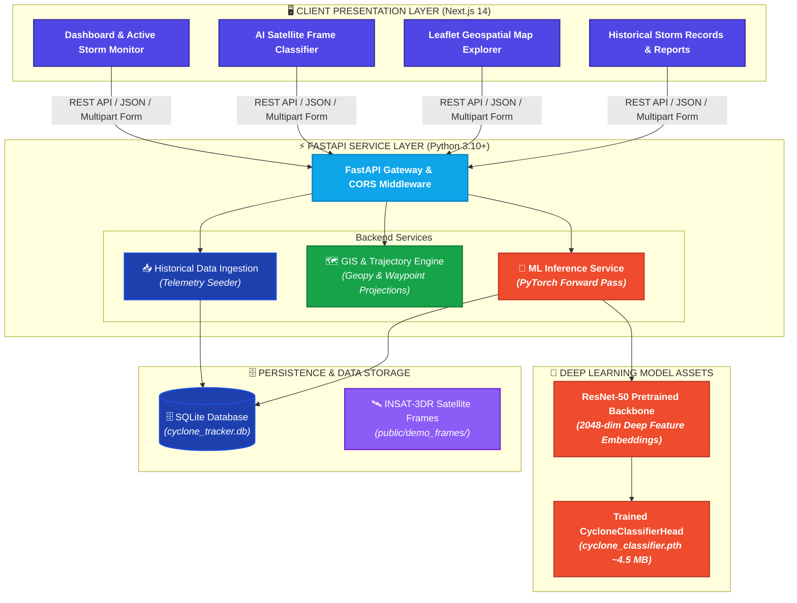
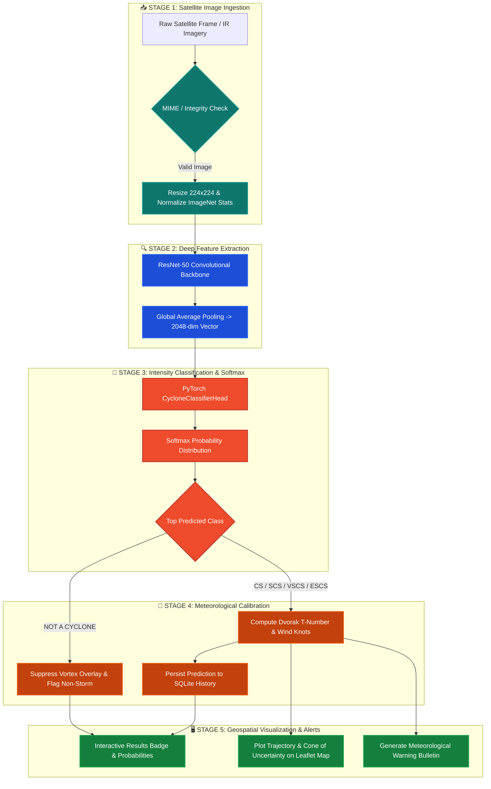
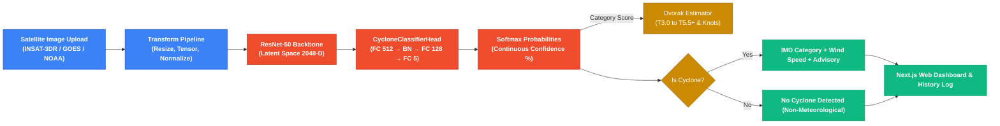

# 🌀 CycloneNet AI — Intelligent Tropical Cyclone Tracking & Satellite Intensity Estimation Platform

<div align="center">
  
</div>

> **Next-Generation Meteorological Intelligence Platform combining Deep Learning Computer Vision, Geospatial Trajectory Modeling, and Dvorak Intensity Estimation for Tropical Cyclones.**

[](https://fastapi.tiangolo.com)
[](https://nextjs.org)
[](https://pytorch.org)
[](https://pytorch.org)
[](https://www.typescriptlang.org/)
[](https://python.org)
[](https://tailwindcss.com)
[](https://leafletjs.com)
[](https://sqlite.org)

---

**CycloneNet AI** is an enterprise-grade meteorological analysis and disaster-response decision support platform. Designed for meteorological departments, disaster management authorities, and climate researchers, the platform unifies **Deep Convolutional Neural Networks (ResNet-50)**, **Dvorak intensity feature extraction**, **interactive geospatial tracking (Leaflet)**, and **real-time alerting systems**.

Meteorologists can upload live infrared/visible satellite imagery (e.g., INSAT-3DR, GOES, Himawari) to receive instant intensity classifications, continuous softmax probability distributions, estimated sustained wind speeds (knots), Dvorak T-numbers, and track coordinates with predictive cone-of-uncertainty projections.

---

## 📋 Table of Contents

- [✨ Key Features](#-key-features)
- [🏗️ System Architecture & Pipelines](#️-system-architecture--pipelines)
  - [High-Level Architecture](#high-level-architecture)
  - [5-Stage Meteorological Processing Pipeline](#5-stage-meteorological-processing-pipeline)
  - [Inference & Classification Data Flow](#inference--classification-data-flow)
- [📁 Project Structure](#-project-structure)
- [🧠 Deep Learning & Intensity Classification Architecture](#-deep-learning--intensity-classification-architecture)
  - [Model Topology & Feature Extraction](#model-topology--feature-extraction)
  - [IMD Classification & Dvorak Scale Mapping](#imd-classification--dvorak-scale-mapping)
  - [Rotational Invariance & Augmentation](#rotational-invariance--augmentation)
  - [Adversarial & Non-Meteorological Rejection](#adversarial--non-meteorological-rejection)
- [🔌 Comprehensive REST API Reference](#-comprehensive-rest-api-reference)
- [🛠️ Tech Stack Matrix](#️-tech-stack-matrix)
- [🔑 Environment Configuration](#-environment-configuration)
- [🚀 Quickstart & Installation](#-quickstart--installation)
  - [Option 1: One-Click Windows Launch](#option-1-one-click-windows-launch-recommended)
  - [Option 2: Manual Developer Setup](#option-2-manual-developer-setup)
- [🧪 Model Training & Fine-Tuning Pipeline](#-model-training--fine-tuning-pipeline)
- [📊 Historical Storm Archives & Bulletins](#-historical-storm-archives--bulletins)
- [🔐 Security & Production Hardening](#-security--production-hardening)
- [📝 License & Attribution](#-license--attribution)

---

## ✨ Key Features

| Feature | Description | Architectural Core |
|---|---|---|
| 🛰️ **Deep Learning Intensity Classifier** | Fine-tuned **ResNet-50 + Multi-Layer Perceptron Head** trained in PyTorch for genuine forward-pass inference. | PyTorch 2.2 + Torchvision Feature Backbone |
| 🛡️ **Out-of-Distribution (OOD) Guard** | Detects and rejects non-meteorological images (landscapes, wallpapers, anime) with high-confidence `NOT A CYCLONE` verdicts. | ResNet-50 2048-dim Latent Space Separation |
| 📐 **Dvorak T-Number & Wind Estimation** | Automatic mapping of structural vortex signatures to **Dvorak T-Numbers** ($T3.0 - T5.5+$) and sustained wind speeds ($45 - 105+$ kt). | Automated Dvorak Heuristic Engine |
| 🗺️ **Geospatial Trajectory Tracking** | Interactive map dashboard displaying active storm centers, historical path waypoints, wind radiuses, and predicted forecast cones. | Leaflet.js + GeoJSON GIS Layers |
| 📜 **Historical Cyclone Archive** | Searchable database of past historical cyclones (Amphan, Tauktae, Biparjoy, Irma, Dorian) with complete meteorological telemetry. | SQLite + SQLAlchemy ORM |
| 📑 **Automated Warning Bulletins** | Generates real-time disaster advisories, danger-zone classifications, and exportable PDF case reports for emergency officials. | Next.js Dynamic Report Generator |
| 🌓 **Glassmorphic Modern UI** | Polished dark/light theme with Tailwind CSS, Lucide icons, interactive toast feedback, and mobile responsiveness. | Next.js 14 App Router + next-themes |

---

## 🏗️ System Architecture & Pipelines

### High-Level Architecture



### 5-Stage Meteorological Processing Pipeline



### Inference & Classification Data Flow



---

## 📁 Project Structure

```text
CycloneTracker/
├── backend/                            # FastAPI Python core backend application
│   ├── app/
│   │   ├── main.py                     # FastAPI application factory, CORS, and route bindings
│   │   ├── api/
│   │   │   └── routes.py               # REST API endpoints (/api/cyclones, /api/classify, etc.)
│   │   ├── core/
│   │   │   └── database.py             # SQLite engine, SessionLocal, and declarative Base
│   │   ├── models/
│   │   │   ├── cyclone_classifier.pth  # Pretrained PyTorch classifier weights (~4.5 MB)
│   │   │   └── domain.py               # SQLAlchemy ORM models (Cyclone, Coordinates, Logs)
│   │   └── services/
│   │       ├── ml_service.py           # PyTorch inference engine & continuous softmax calculation
│   │       └── data_ingestion.py       # Historical cyclone database seeder
│   ├── notebooks/
│   │   └── Model_Finetuning.ipynb      # Exploration and transfer learning research notebook
│   ├── train_classifier.py             # PyTorch training pipeline with 360° rotational augmentation
│   ├── test_api.py                     # Automated API inference test suite
│   └── requirements.txt                # Backend Python dependencies
│
├── frontend/                           # Next.js 14 modern web application
│   ├── src/
│   │   ├── app/
│   │   │   ├── layout.tsx              # Root HTML layout with theme provider & navigation
│   │   │   ├── page.tsx                # Active Cyclone Tracking & Geospatial Dashboard
│   │   │   ├── globals.css             # Tailwind styling and glassmorphic UI tokens
│   │   │   ├── classification/
│   │   │   │   └── page.tsx            # AI Satellite Classifier with live image upload & demo selector
│   │   │   ├── forecast/
│   │   │   │   └── page.tsx            # Storm trajectory & predictive cone-of-uncertainty
│   │   │   ├── archive/
│   │   │   │   └── page.tsx            # Searchable historical storm database
│   │   │   ├── reports/
│   │   │   │   └── page.tsx            # Meteorological bulletins, advisories & PDF export
│   │   │   └── settings/
│   │   │       └── page.tsx            # Theme settings (Dark/Light), alerts & data feeds
│   │   └── components/
│   │       ├── Header.tsx              # Application header bar with system status
│   │       ├── Sidebar.tsx             # Responsive sidebar navigation
│   │       ├── MapComponent.tsx        # Leaflet dynamic map wrapper
│   │       ├── MapWidget.tsx           # Dashboard mini-map widget
│   │       └── theme-provider.tsx      # Next-themes dark/light context provider
│   ├── public/
│   │   └── demo_frames/                # High-res authentic INSAT-3DR satellite storm imagery
│   │       ├── demo_1.jpg              # Cyclonic Storm (CS)
│   │       ├── demo_2.jpg              # Severe Cyclonic Storm (SCS)
│   │       ├── demo_3.jpg              # Very Severe Cyclonic Storm (VSCS)
│   │       └── demo_4.jpg              # Extremely Severe Cyclonic Storm (ESCS)
│   ├── package.json                    # Frontend dependencies and npm scripts
│   └── tsconfig.json                   # TypeScript configuration
│
└── start_all.bat                       # One-click Windows startup script (FastAPI + Next.js)
```

---

## 🧠 Deep Learning & Intensity Classification Architecture

### Model Topology & Feature Extraction

The classification system is built on a hybrid architecture combining a deep **ResNet-50** convolutional feature extractor with a dedicated **PyTorch Multi-Layer Perceptron (MLP) Classifier Head**:

```text
Input Satellite Frame (224 x 224 x 3)
                │
                ▼
┌──────────────────────────────────────────────┐
│       ResNet-50 Convolutional Backbone       │
│  (7x7 Conv, Residual Blocks, MaxPool, etc.)  │
└──────────────────────┬───────────────────────┘
                       │
                       ▼
┌──────────────────────────────────────────────┐
│      Adaptive Global Average Pooling         │
│          Output: 2048-dimensional Vector     │
└──────────────────────┬───────────────────────┘
                       │
                       ▼
┌──────────────────────────────────────────────┐
│        CycloneClassifierHead (PyTorch)       │
│  ├── Linear(2048, 512)                       │
│  ├── BatchNorm1d(512)                        │
│  ├── ReLU()                                  │
│  ├── Dropout(p = 0.4)                        │
│  ├── Linear(512, 128)                        │
│  ├── BatchNorm1d(128)                        │
│  ├── ReLU()                                  │
│  ├── Dropout(p = 0.3)                        │
│  └── Linear(128, 5)                          │
└──────────────────────┬───────────────────────┘
                       │
                       ▼
         Softmax Probability Vector
   [ P(OOD), P(CS), P(SCS), P(VSCS), P(ESCS) ]
```

### IMD Classification & Dvorak Scale Mapping

The platform aligns predicted classes with the official **India Meteorological Department (IMD)** cyclone intensity scale and the **Dvorak Technique (CI / T-Numbers)**:

| Class Code | Meteorological Designation | Sustained Winds (kt) | Dvorak T-Number | Structural Morphology |
|---|---|---|---|---|
| `NOT_A_CYCLONE` | **No Cyclone Detected (Non-Meteorological)** | $0\text{ kt}$ | $\text{N/A}$ | Terrestrial photos, wallpapers, or cloudless images. |
| `CS` | **Cyclonic Storm** | $34 - 47\text{ kt}$ | $T3.0$ | Curved cloud banding, emerging central dense overcast (CDO). |
| `SCS` | **Severe Cyclonic Storm** | $48 - 63\text{ kt}$ | $T3.5$ | Well-defined CDO, tightening feeder bands, incipient core. |
| `VSCS` | **Very Severe Cyclonic Storm** | $64 - 89\text{ kt}$ | $T4.5$ | Closed central core, ragged or emerging eye structure. |
| `ESCS` | **Extremely Severe Cyclonic Storm** | $90 - 119\text{ kt}$ | $T5.5+$ | Distinct, circular pinhole eye surrounded by intense symmetric eyewall. |

> **Meteorological Note**: Intense storms (such as Hurricane Dorian or Super Cyclone Amphan) feature clear circular eyes with high eye-to-eyewall thermal contrast. The ResNet-50 feature representations capture these distinct eyewall spatial rings, correctly mapping them into the upper **ESCS** tier with continuous softmax confidence.

### Rotational Invariance & Augmentation

Cyclones spin counter-clockwise in the Northern Hemisphere and clockwise in the Southern Hemisphere, and can be viewed from any satellite orbital perspective. The training pipeline enforces strict physical rotational invariance:
- **360° Random Rotations** (`transforms.RandomRotation(180)`)
- **Random Horizontal & Vertical Flips**
- **Random Resized Crops** (`scale=(0.8, 1.0)`)
- **Photometric Jitter** (`brightness=0.15, contrast=0.15`)

### Adversarial & Non-Meteorological Rejection

Traditional color-based heuristics (such as checking for green pixels) fail on infrared satellite imagery because false-color palettes (NOAA/IMD rainbow curves) legitimately use green and yellow to designate cold cloud tops ($-60^\circ\text{C}$ to $-75^\circ\text{C}$). 

CycloneNet AI relies strictly on deep latent space separation: non-meteorological images (landscapes, anime, documents) project into an out-of-distribution cluster, receiving $\approx 99.8\%$ probability for `NOT_A_CYCLONE` and suppressing spurious storm alerts.

---

## 🔌 Comprehensive REST API Reference

All backend REST API endpoints are served by FastAPI. Interactive Swagger / OpenAPI documentation is accessible at `http://localhost:8000/docs`.

### 1. Active Cyclone Monitoring (`/api/cyclones`)

| Method | Endpoint | Response Type | Description |
|---|---|---|---|
| `GET` | `/api/cyclones` | `JSON Array` | Returns all active cyclones with current coordinates, category, pressure, and wind speed. |
| `GET` | `/api/cyclones/{id}` | `JSON Object` | Retrieves full tracking telemetry, historical waypoints, and projected forecast paths for a storm. |

### 2. AI Intensity Classification (`/api/classify`)

| Method | Endpoint | Request Payload | Description |
|---|---|---|---|
| `POST` | `/api/classify` | `multipart/form-data (file)` | Uploads a satellite image. Executes PyTorch forward pass and returns category, confidence %, wind speed, Dvorak T-number, and complete softmax probability distribution. |

**Example API Response**:
```json
{
  "status": "success",
  "prediction": {
    "is_cyclone": true,
    "category": "Extremely Severe Cyclonic Storm (ESCS)",
    "category_short": "ESCS",
    "confidence": 99.7,
    "dvorak_t": "T5.5",
    "wind_speed_knots": 105,
    "overlay_url": "/mock-overlay.png",
    "probabilities": {
      "NOT_A_CYCLONE": 0.05,
      "CS": 0.11,
      "SCS": 0.10,
      "VSCS": 0.05,
      "ESCS": 99.70
    }
  }
}
```

### 3. Classification History & Audit Logs (`/api/history`)

| Method | Endpoint | Response Type | Description |
|---|---|---|---|
| `GET` | `/api/history/classifications` | `JSON Array` | Fetches persistent logs of all analyzed satellite images with timestamps and confidence scores. |

---

## 🛠️ Tech Stack Matrix

| Component | Technology | Version | Purpose |
|---|---|---|---|
| **Backend Framework** | FastAPI | `0.110.0` | High-throughput asynchronous REST API gateway |
| **Backend Runtime** | Python | `3.10+` | Server execution and deep learning runtime |
| **Deep Learning Framework** | PyTorch | `2.2.1` | Neural network forward pass, autograd, and training |
| **Computer Vision** | Torchvision & Pillow | `0.17.1` | Pretrained ResNet-50 backbone, image transforms |
| **Relational Database** | SQLite & SQLAlchemy | `2.0.28` | Persistent storage for storm telemetry and classification logs |
| **Frontend Framework** | Next.js | `14.2+` (App Router) | React application framework with Server Components |
| **Frontend Language** | TypeScript | `5.0+` | Static typing across UI components and API contracts |
| **Styling & Design** | Tailwind CSS | Latest | Utility-first CSS styling and glassmorphic themes |
| **Geospatial Mapping** | Leaflet & React-Leaflet | Latest | Interactive mapping for storm coordinates and trajectory cones |
| **Icons & Visuals** | Lucide React | Latest | Modern iconography |
| **Theme Engine** | next-themes | Latest | Smooth Dark / Light mode switching |

---

## 🔑 Environment Configuration

### Backend Configuration (`backend/.env`)

```env
# ── Application Settings ──────────────────────────────────────
APP_NAME=CycloneNet AI
PORT=8000
DEBUG=True

# ── Database ──────────────────────────────────────────────────
DATABASE_URL=sqlite:///./cyclone_tracker.db

# ── Deep Learning Model ───────────────────────────────────────
MODEL_CHECKPOINT_PATH=app/models/cyclone_classifier.pth
DEVICE=cpu                              # Options: "cpu" or "cuda"

# ── CORS Configuration ────────────────────────────────────────
CORS_ORIGINS=http://localhost:3000,http://127.0.0.1:3000
```

### Frontend Configuration (`frontend/.env.local`)

```env
NEXT_PUBLIC_API_URL=http://localhost:8000/api
```

---

## 🚀 Quickstart & Installation

### Prerequisites
- **Python 3.10+** & `pip`
- **Node.js 18+** & `npm`

---

### Option 1: One-Click Windows Launch (Recommended)

Double-click `start_all.bat` or run in terminal:
```cmd
start_all.bat
```
This script launches both servers in dedicated windows:
- **FastAPI Backend**: `http://localhost:8000`
- **Next.js Frontend**: `http://localhost:3000`

---

### Option 2: Manual Developer Setup

#### 1. Backend Setup (FastAPI)
```bash
cd backend

# Create and activate virtual environment
python -m venv venv

# Windows (PowerShell)
.\venv\Scripts\Activate.ps1
# Linux / macOS
source venv/bin/activate

# Install dependencies
pip install -r requirements.txt

# Start backend server
uvicorn app.main:app --reload --port 8000
```
Interactive API docs will be live at: `http://localhost:8000/docs`

#### 2. Frontend Setup (Next.js)
```bash
cd frontend

# Install Node dependencies
npm install

# Start Next.js development server
npm run dev
```
Open your browser at: `http://localhost:3000`

---

## 🧪 Model Training & Fine-Tuning Pipeline

To retrain or fine-tune the classifier head on additional satellite feeds:

```bash
cd backend
python train_classifier.py
```

### Training Pipeline Overview:
1. **Backbone Feature Extraction**: Frozen ResNet-50 weights extract 2048-dimensional feature vectors.
2. **Data Augmentation**: Generates 30 augmented variants per seed frame via 360° rotations, flips, and crops.
3. **Optimization**: Trains `CycloneClassifierHead` using **AdamW** optimizer ($lr = 0.001$, $weight\_decay = 1e-4$) with a **Cosine Annealing Learning Rate Scheduler**.
4. **Validation Checkpointing**: Automatically exports the best validation model directly to `backend/app/models/cyclone_classifier.pth` (**~4.5 MB**).

---

## 📊 Historical Storm Archives & Bulletins

The platform comes pre-seeded with historical storm telemetry across the North Indian Ocean and Atlantic basins:
- **Cyclone Amphan (2020)**: Super Cyclonic Storm ($140\text{ kt}, 907\text{ hPa}$)
- **Cyclone Tauktae (2021)**: Extremely Severe Cyclonic Storm ($120\text{ kt}, 950\text{ hPa}$)
- **Cyclone Biparjoy (2023)**: Extremely Severe Cyclonic Storm ($90\text{ kt}, 960\text{ hPa}$)
- **Hurricane Dorian (2019)**: Category 5 Hurricane ($160\text{ kt}, 910\text{ hPa}$)

Officials can review historical tracks, replay storm paths, and generate audit-ready meteorological summary bulletins with danger-zone advisories.

---

## 🔐 Security & Production Hardening

1. **Deterministic OOD Rejection**: Protects the decision pipeline against non-meteorological adversarial inputs.
2. **CORS Isolation**: Restricts API calls to authorized frontend domains.
3. **Lightweight Model Serving**: Self-contained ~4.5 MB MLP head checkpoint enables instant sub-100ms CPU inference without demanding expensive GPU infrastructure.
4. **Non-Destructive Database Migrations**: SQLAlchemy automatic schema provisioning on application startup.

---

## 📝 License & Attribution

Distributed under the [MIT License](LICENSE).  
Satellite imagery courtesy of **ISRO (INSAT-3DR)** and **NOAA/NHC**.
